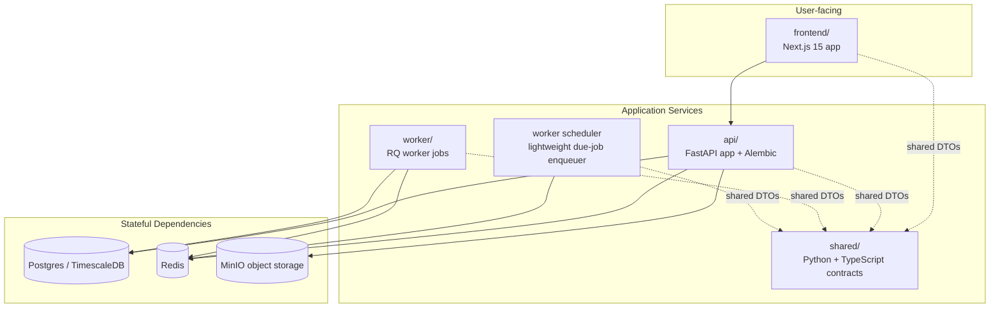

# Container View

This container-level view shows the internal service split used by the repository and Docker Compose deployment model.

## Responsibilities
- `frontend/`: authenticated dashboard shell, ingestion UI, dashboard views, and browser-side API integration.
- `api/`: FastAPI application factory, `/health` and `/readiness`, versioned REST routes, ingestion, auth, analytics, pricing services, manual refresh/sync endpoints, telemetry, and rate limiting.
- `worker/`: Redis-backed RQ jobs for owned-asset refresh, Binance sync, alert/review-style background work, and other queued tasks.
- `worker scheduler`: lightweight scheduler process in the local app Compose profile that enqueues due owned-refresh and optional broker-sync jobs into Redis/RQ with single-flight and bounded catch-up behavior.
- `shared/`: cross-language contracts consumed by backend tests and frontend type-check smoke coverage.
- Stateful services run outside the app containers and are provisioned through Docker Compose for local-first development.
