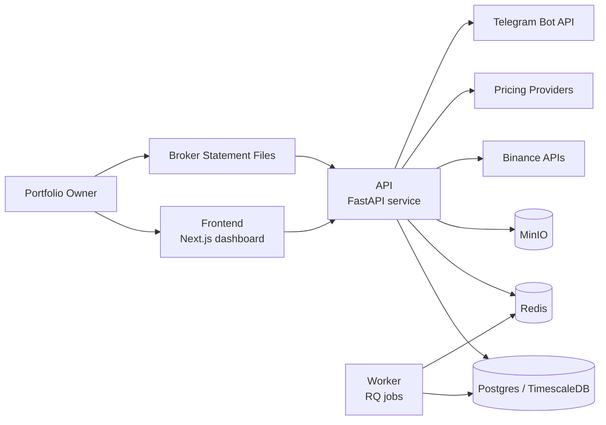

# System Context

This C4-style system context diagram summarizes the external systems and user-facing boundaries for the local-first app.

## Notes
- The frontend is the single authenticated UI for portfolio review, ingestion, and settings.
- The API owns normalization, auth, import workflows, read/write access to the core data model, and the in-process scheduler currently used for recurring alert evaluation.
- The worker provides Redis-backed job entrypoints against the same backing stores; it does not currently own recurring schedules, but queued jobs can invoke shared alert logic that reaches pricing providers and Telegram.
- External integrations are currently Binance, pricing providers, uploaded broker artifacts, and Telegram notifications.
